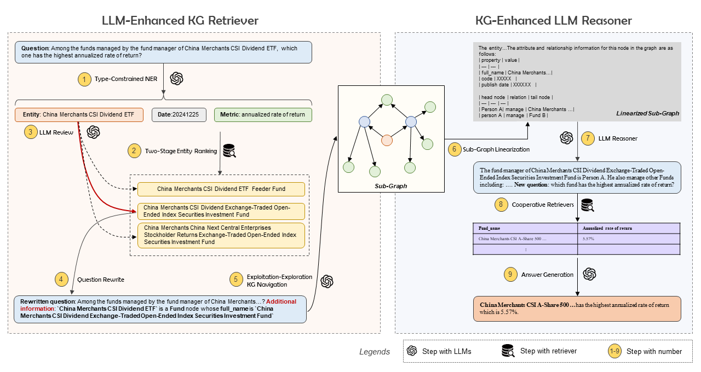

<h1 align="center"> SLAG   Enhancing LLMs for Expert Question Answering by Synergizing   with Knowledge Graphs </h1>

SLAG a QA framework for expert fields by **S**ynergizing large **L**anguage models **A**nd knowledge **G**raphs. It is designed to improve the correctness of KG retrieval and to intelligently coordinate KG retrievers with other retrieval methods through bidirectional enhancement between LLMs
and KGs:
* a LLM-Enhanced KG retriever is proposed to resolve entity ambiguities in queries and to accurately extract pertinent sub-graphs.
* a KG-Enhanced LLM reasoner is designed to distill sub-graphs and to flexibly generate answers or explicit queries for cooperative retrievers.

Conductable code and illustration are comming soon.