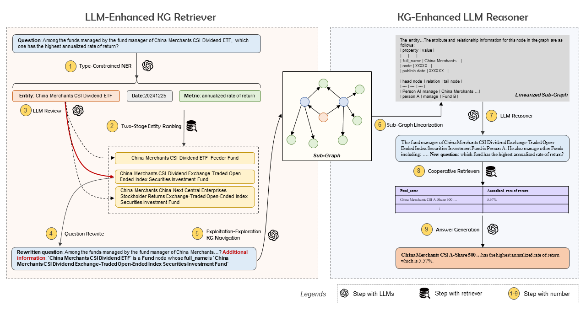

<div align="center">

# SLAG

### Enhancing LLMs for Expert Question Answering by Synergizing With Knowledge Graphs

[](https://doi.org/10.1109/TKDE.2026.3731277)
[](#quick-start)
[](#2-start-neo4j)
[](#open-source-scope)

**The paper has been accepted by IEEE Transactions on Knowledge and Data Engineering (TKDE).**

Shuoling Liu · Hui Wu · Kun Yi · Pengtao Yang · Liyuan Chen · Kai Chen · Qiang Yang

[[Paper](https://doi.org/10.1109/TKDE.2026.3731277)] · [[Overview](#overview)] · [[Quick Start](#quick-start)] · [[Evaluate](#evaluation)] · [[Citation](#citation)]

</div>

## Overview

**SLAG** is a framework for expert question answering that **S**ynergizes **L**arge language models **A**nd knowledge **G**raphs. It improves knowledge-graph retrieval and coordinates graph retrieval with text retrieval through bidirectional enhancement between LLMs and KGs.

- **LLM-enhanced KG retrieval** resolves entity ambiguity in user questions and extracts relevant subgraphs more accurately.
- **KG-enhanced LLM reasoning** distills retrieved subgraphs and dynamically produces either a final answer or an explicit follow-up query for a complementary retriever.
- **Cooperative retrieval** combines structured graph evidence with unstructured corpus evidence for knowledge-intensive, multi-hop questions.

Across datasets spanning different expert domains, tasks, and languages, SLAG achieves a **13% relative F1 improvement** over state-of-the-art methods on public benchmarks. It has also been deployed in an industrial financial QA system, where it outperformed the system's latest online version.

<p align="center">
  
</p>

## Open-source scope

This repository provides the reproducible, open-source implementation of SLAG on three public multi-hop QA datasets. Their knowledge graphs are extracted from the source corpora using OpenIE, following the data-construction setting inspired by [HippoRAG](https://github.com/OSU-NLP-Group/HippoRAG).

| Dataset | Task | Included resources |
| --- | --- | --- |
| [2WikiMultiHopQA](https://github.com/Alab-NII/2wikimultihop) | Multi-hop question answering | Dataset, corpus, KG-backed pipeline, and outputs |
| [HotpotQA](https://hotpotqa.github.io/) | Explainable multi-hop question answering | Dataset, corpus, KG-backed pipeline, and outputs |
| [MuSiQue](https://github.com/StonyBrookNLP/musique) | Compositional multi-hop question answering | Dataset, corpus, KG-backed pipeline, and outputs |

Due to company data-privacy requirements, experiments on the proprietary financial knowledge graph are not included. The public implementation can be adapted to a domain knowledge graph with a strict schema by replacing the graph data and aligning the retrieval configuration.

## Quick start

### 1. Install dependencies

```bash
git clone https://github.com/EFundAI/SLAG.git
cd SLAG

conda create -n slag python=3.9 -y
conda activate slag
python -m pip install -r requirements.txt
```

### 2. Start Neo4j

Install [Neo4j Desktop](https://neo4j.com/download/) or start Neo4j 5.20 with Docker:

```bash
docker run -d \
  --name multihop-public \
  -p 7474:7474 \
  -p 7687:7687 \
  -e NEO4J_AUTH=neo4j/neo4jneo4j \
  -e NEO4J_apoc_export_file_enabled=true \
  -e NEO4J_apoc_import_file_enabled=true \
  -e NEO4J_apoc_import_file_use__neo4j__config=true \
  -e 'NEO4J_PLUGINS=["apoc"]' \
  neo4j:5.20.0
```

### 3. Start Milvus

SLAG uses Milvus as its vector store. The following commands start the standalone deployment:

```bash
curl -sfL https://raw.githubusercontent.com/milvus-io/milvus/master/scripts/standalone_embed.sh \
  -o standalone_embed.sh
bash standalone_embed.sh start
```

For other deployment options, see the [Milvus installation guide](https://milvus.io/docs/install_standalone-docker.md).

### 4. Configure services

Create a `.env` file in the repository root:

```dotenv
OPENAI_API_BASE=https://your-openai-compatible-endpoint/v1
OPENAI_API_KEY=your-api-key
OPENAI_USER_NAME=your-user-name

NEO4J_URI=bolt://localhost:7687
NEO4J_USERNAME=neo4j
NEO4J_PASSWORD=neo4jneo4j
NEO4J_DATABASE=neo4j

MILVUS_URI=http://localhost:19530
```

> [!CAUTION]
> Never commit API keys or production database credentials to the repository.

### 5. Prepare the data

Load the provided graph backup into Neo4j. Neo4j 5 expects the dump filename to match the target database, so first stage the included backup under the expected name:

```bash
mkdir -p ./data/neo4j-load
cp ./data/mhkg.dump ./data/neo4j-load/neo4j.dump
neo4j-admin database load neo4j \
  --from-path=./data/neo4j-load \
  --overwrite-destination=true
```

The repository currently stores the backup as `data/mhkg.dump`. If Neo4j runs in Docker, copy or mount this file into the container's import directory before restoring it.

Create the graph-node vector index in Milvus:

```bash
python src/vectorize_kg.py
```

Create the corpus indexes used by the RAG retrievers:

```bash
python src/vectorize_rag.py
```

## Running SLAG

The entry point is [`src/run_slag.py`](src/run_slag.py). It supports batch evaluation and an interactive LangServe playground.

### Batch mode

```bash
python src/run_slag.py \
  --dataset_name 2wikimultihopqa \
  --run_mode batch \
  --use_llm_review
```

Replace `2wikimultihopqa` with `hotpotqa` or `musique` to run another supported dataset. Generated results are written to:

```text
outputs/<dataset_name>/<dataset_name>_with_newquery_dataset.json
```

### Server mode

```bash
python src/run_slag.py \
  --dataset_name 2wikimultihopqa \
  --run_mode server \
  --use_llm_review
```

Then open the LangServe playground at [http://localhost:7105/slag/playground](http://localhost:7105/slag/playground) and submit a question from the selected dataset.

### Main options

| Option | Description | Default |
| --- | --- | --- |
| `--dataset_name` | `2wikimultihopqa`, `hotpotqa`, or `musique` | Required |
| `--run_mode` | `batch` or `server` | Required |
| `--use_llm_review` | Enable LLM review during entity linking | Disabled |
| `--ner_llm_name` | Model used for named-entity recognition | `gpt-4o` |
| `--reason_llm_name` | Model used for reasoning | `gpt-4o` |
| `--review_llm_name` | Model used for entity-link review | `gpt-4o` |
| `--reranker_model_path` | Local path or Hugging Face ID for the reranker | `BAAI/bge-reranker-v2-m3` |

## Evaluation

Compare Naive RAG, Hybrid RAG, and SLAG on the three public benchmarks:

```bash
# 2WikiMultiHopQA
python src/run_eval_2wikimultihopqa.py

# HotpotQA
python src/run_eval_hotpotqa.py

# MuSiQue
python src/run_eval_musique.py
```

Experiment metrics are tracked with [Aim](https://github.com/aimhubio/aim). Launch the local dashboard with:

```bash
aim up
```

## Repository structure

```text
SLAG/
├── data/                   # Public datasets, corpora, and KG backup
├── demonstrations/         # Few-shot NER and reasoning examples
├── images/                 # README figures
├── outputs/                # Reproducible public-dataset outputs
├── src/
│   ├── chains/             # Entity linking, graph exploration, and reasoning
│   ├── eval/               # Dataset-specific evaluation utilities
│   ├── rag_solutions/      # Naive RAG, Hybrid RAG, ColBERTv2, and SLAG
│   ├── utils/              # Reranking and service helpers
│   ├── run_slag.py         # Main batch/server entry point
│   ├── vectorize_kg.py     # KG node indexing
│   └── vectorize_rag.py    # Corpus indexing
├── README.md
└── requirements.txt
```

## Publication

**Enhancing LLMs for Expert Question Answering by Synergizing With Knowledge Graphs**<br>
Shuoling Liu, Hui Wu, Kun Yi, Pengtao Yang, Liyuan Chen, Kai Chen, and Qiang Yang<br>
*IEEE Transactions on Knowledge and Data Engineering*, 2026<br>
[https://doi.org/10.1109/TKDE.2026.3731277](https://doi.org/10.1109/TKDE.2026.3731277)

The manuscript was received on May 12, 2025, revised on August 20, 2026, and accepted on August 29, 2026. Qiang Yang is the corresponding author.

## Citation

If you use SLAG in your research, please cite:

```bibtex
@article{liu2026enhancing,
  author  = {Liu, Shuoling and Wu, Hui and Yi, Kun and Yang, Pengtao and
             Chen, Liyuan and Chen, Kai and Yang, Qiang},
  journal = {IEEE Transactions on Knowledge and Data Engineering},
  title   = {Enhancing LLMs for Expert Question Answering by Synergizing With Knowledge Graphs},
  year    = {2026},
  doi     = {10.1109/TKDE.2026.3731277}
}
```

---

<div align="center">

If SLAG helps your research, consider giving the repository a ⭐.

</div>
